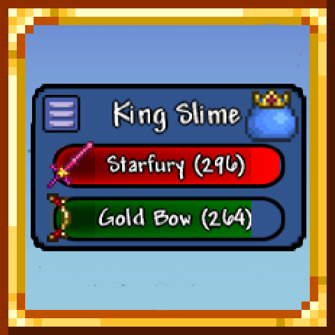

# DPSPanel

<!-- PROJECT LOGO -->
 

  

  <h3 align="center">DPSPanel</h3>

  The ultimate Terraria DPS Mod, displaying damage calculation per player and per weapon!

  

    <a href="<strong> [View Demo](##Demo) »</strong></a>
     
     
    <a href="https://steamcommunity.com/sharedfiles/filedetails/?id=3408391079">Workshop Page</a>
    &middot;
    <a href="https://github.com/emyhrberg/DPSPanel/issues?q=sort%3Aupdated-desc+is%3Aissue+is%3Aopen">Bug Report</a>
  

## Demo

## Old version (unused)

